# Node-RED SNMP Gateway

This Node-RED project is a middleware service used to fetch SNMP objects from devices, store them in a local SQLite database, and serve the data over HTTP.

In summary, the application does 3 things:

1. Initialise: On startup, creates a SQLite database (or drops and recreates the tables if it already exists) and optionally populates it with an snmp object list and device list, loaded from a user defined csv file.
2. Fetch snmp values: Continually fetches object values from SNMP devices and inserts/updates the database.
3. HTTP serve XML: Provides a basic XML web API. Listens on a http endpoint and responds with SNMP object and device data from the database in an XML format.

Note that while the application provides nodes to serve the SNMP data as an XML web service (3), all the snmp data is written to and read from a SQLite database, so this interface could easily be swapped out for any other protocol, eg Modbus TCP, JSON API etc.

## Quick start

To deploy in your existing Node-RED instance:

1. Enable [projects](https://nodered.org/docs/user-guide/projects/) in your Node-RED instance if they aren't already.
1. Download and unzip this project into your Node-RED `projects` directory.
1. Install dependency nodes, see [below](#dependencies).
1. Configure the SNMP object list csv file, see [below](#snmp-object-list-csv).
1. Start the server, open the flow and configure the [configuration nodes, see below](#configuration-nodes), web service and database as required.

If you'd like to deploy Node-RED and `node-red-snmp-gateway` to production on a Windows machine, see [below](#deploy-to-production-on-windows).

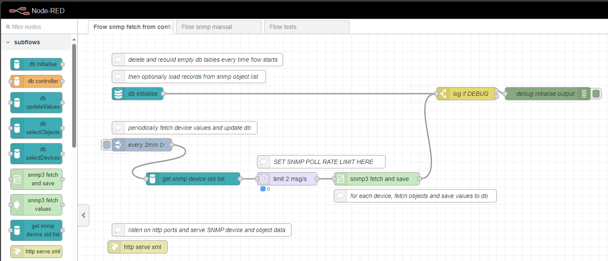

## Dependencies

- Node.js (if SNMPv3 DES Privacy algorithm is required, install Node.js v16 or less, see below)
- Node-RED (tested with v3.1.9)
- Git (optional, for running as a [Node-RED Project](https://nodered.org/docs/user-guide/projects/))
- pm2-installer & pm2 (optional, for running Node-RED on Windows as a service)
- Node-RED nodes:
    - node-red-node-snmp
    - node-red-node-sqlite (optional, for storing data in sqlite)

## Configuration nodes

### sqlite db
Set the path to where the SQLite database is to be stored. Default `C:\ProgramData\node-red\projects\node-red-snmp-gateway\data\db`

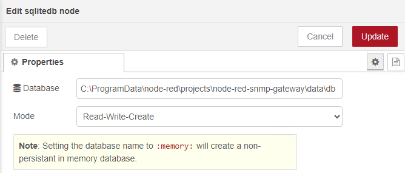

### global config
Set the global environment varibales here:
- `LOG_LEVEL`: currently does nothing.
- `SNMP_OBJECT_LIST`: The path to the SNMP object list CSV file, see [below](#snmp-object-list-csv). Default `C:\ProgramData\node-red\projects\node-red-snmp-gateway\data\SNMPObjectList.csv`

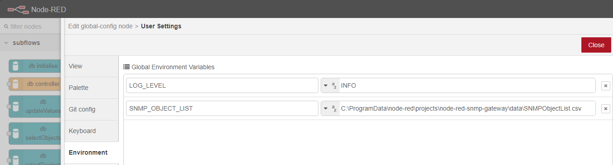

## Subflows

### db initialise

Initialises the SQLite database at start of flow or whenever data needs to be reset/reloaded. Interfaces with `db controller`.

- Drops and recreates empty `snmp_devices` and `snmp_objects` tables.
- Optionally loads SNMP device and object data into database from global environment variable `global.env.SNMP_OBJECT_LIST` csv file. Defaults to `C:\\ProgramData\\node-red\\projects\\node-red-snmp-gateway\\data\\SNMPObjectList.csv`. csv should contain a list of all snmp objects, with the following the following headers:
  - DeviceName
  - OID
  - Server IP
  - Version
  - User
  - AuthPass
  - PrivPass
  - SecurityLevel
  - AuthMode
  - PrivMode
  - Community
  - FriendlyName
  
**Input:** Trigger once at start of flow.

**Output:** `msg.payload` contains the response from SQLite node.

### db controller

Database controller node, interfaces with the SQLite DB (create/read/update/delete). All flows should interface with a `db controller` node rather than the `db` directly.

**Input:** The input message requires the following data:
- `msg.action`: (string enum: `loadObjectList` | `loadDeviceList` | `updateValues` | `selectObjects` | `selectDevices` | `initialise` | `updateDeviceUpdated`) see below. The database action to carry out using the message.
- `msg.payload`: (array | object) SQL Query parameters to send to the `node-red-node-sqlite` node.

**Query parameters (optional):**
- `msg.devicename`: filters the table by matching `devicename`.
  - `msg.devicename` may be a substring within the `devicename`, eg `msg.devicename` = \"T1-L00-DC1-A1-PDU\" will return \"T1-L00-DC1-A1-PDU-A\" and \"T1-L00-DC1-A1-PDU-B\"
  - `msg.devicename` may include \"%\" as a wildcard, eg `msg.devicename` = \"T1-L00-DC1-A%-PDU-A\" will return \"T1-L00-DC1-A1-PDU-A\" and \"T1-L00-DC1-A2-PDU-A\"

**Output:** `msg.payload` contains the response from SQLite node.

**msg.action:**
Defines the type of database action:
- `loadObjectList`: inserts data into `snmp_objects` table. Expects array of `snmp_objects` in `msg.payload`.
- `loadDeviceList`: inserts data into `snmp_devices` table. Expects array of `snmp_devices` in `msg.payload`.
- `updateValues`: updates `values` field in the `snmp_objects` table, or inserts new record if no matching devicename/oid exists. Expects either array of `snmp_objects` objects or single object in `msg.payload`.
- `selectObjects`: fetches object list from `snmp_objects`. Can filter by `devicename` using `msg.devicename` in input.
- `selectDevices`: fetches object list from `snmp_objects`. Can filter by `devicename` using `msg.devicename` in input.
- `initialise`: drops and recreates empty `snmp_objects` and `snmp_devices` tables.
- `updateDeviceUpdated`: updates `updated` field for device in `snmp_devices` table. Expects valid `msg.devicename`, updates `updated` field to `CURRENT_TIMESTAMP`.

### snmp3 fetch and save
Fetches objects from a SNMPv3 device using the `snmp3 fetch values` node, then writes the response values to the database using the `db updateValues` node.

**Input:** Input messages should contain the following objects:
- `msg.devicename`: (string) snmp device name (used as id for saving values to db)
- `msg.host`: (string) snmp device hostname/IP address
- `msg.username`: (string) device snmpv3 username
- `msg.securitylevel`: (string enum: `AuthPriv` | `AuthNoPRiv` | `NoAuthNoPRiv` ) string snmpv3 security level
- `msg.authmode`: (string enum: `MD5` | `SHA`) snmpv3 auth protocol
- `msg.authkey`: (string) snmpv3 auth password
- `msg.privmode`: (string enum: `AES` | `DES`) snmpv3 privacy protocol
- `msg.privkey`: (string) snmpv3 privacy password
- `msg.oid`: (string) list of comma seperated oids

**Output:** `msg.payload` contains response from sqlite node.

### get snmp device oid list
Queries `db` and gets list of snmp devices (and connection details) from `snmp_devices` table.\r\nThen for each device, gets a list of its oids from `snmp_objects` table.\r\nPrepares and splits into one message per device, ready to send to an `snmp3 fetch` or `snmp3 fetch and save` node.

**Input:** Triggered by any input. The input msg data is ignored and possibly overwritten.

**Output:** Output messages (one per snmp device) contains the following objects:
- `msg.devicename`: (string) snmp device name (used as id for saving values to db)
- `msg.host`: (string) snmp device hostname/IP address
- `msg.username`: (string) device snmpv3 username
- `msg.securitylevel`: (string enum: `AuthPriv` | `AuthNoPriv` | `NoAuthNoPRiv` ) string snmpv3 security level
- `msg.authmode`: (string enum: `MD5` | `SHA`) snmpv3 auth protocol
- `msg.authkey`: (string) snmpv3 auth password
- `msg.privmode`: (string enum: `AES` | `DES`) snmpv3 privacy protocol
- `msg.privkey`: (string) snmpv3 privacy password
- `msg.oid`: (string) list of comma seperated oids

### http serve xml

Simple XML Web Service.
- Listens on `/objects`, fetches data from `db selectObjects` node and returns XML parsed array of SNMP objects.
- Listens on `/devices`, fetches data from `db selectDevices` node and returns XML parsed array of SNMP devices.

**http query parameters (optional):**
- `devicename`: filters by matching devicename. Applies to both `/objects` and `/devices` endpoints.
  - `devicename` may be a substring within the devicename, eg `?devicename=\"T1-L00-DC1-A1-PDU\"` will return \"T1-L00-DC1-A1-PDU-A\" and \"T1-L00-DC1-A1-PDU-B\".
  - `devicename` may include \"%\" as a wildcard, eg `?devicename=\"T1-L00-DC1-A%-PDU-A\"` will return \"T1-L00-DC1-A1-PDU-A\" and \"T1-L00-DC1-A2-PDU-A\".

## SNMP Object List CSV

When the flow starts, the SQLite database is initialised, then the csv is loaded and values inserted into the `snmp_objects` table and `snmp_devices` table.
A sample CSV config file is provided in `./examples/SNMPObjectList.csv`.

This data tells `node-red-snmp-gateway` which devices to poll and what objects to retrieve.

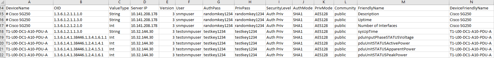

## Connect to the Simple XML Web Service from EBO

**Retrieve SNMP objects:** The `/objects` endpoint provides the SNMP object values. Use query parameters to filter the returned objects. 

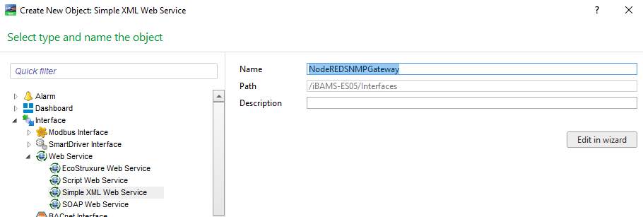
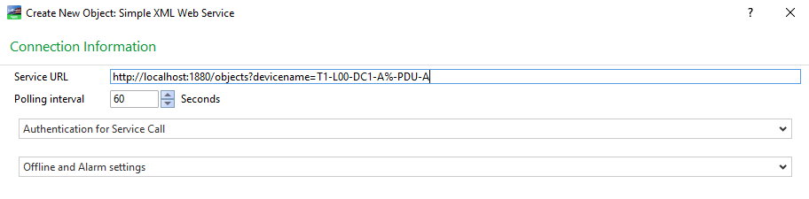
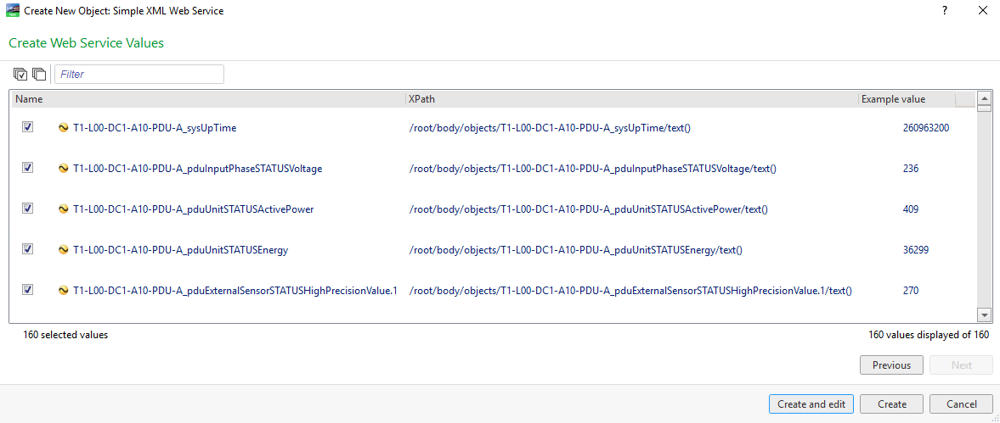
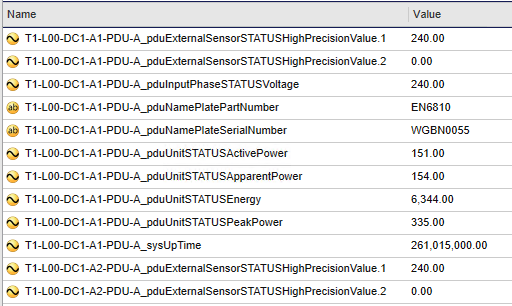

**Monitor SNMP devices:** The `/devices` endpoint provides the UTC timestamp of the last response from the device or 'never' for a device that has never responded since the SQLite database was initialised. Use query parameters to filter the returned devices. 

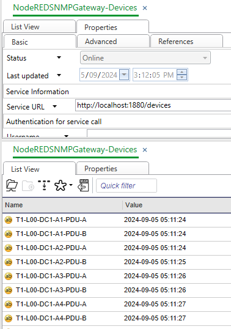

## Deploy to production on Windows

In a default Node.js install, node modules (including Node-RED) are installed in the current users `%APPDATA%`. In a default Node-RED install, the Node-RED `userDir` is installed in the current users `~\.node-red` directory. Neither of these will work well if the flow is to run in production as a service, independently of user login, and handle server restarts and faults.

Instead, [pm2-installer](https://github.com/jessety/pm2-installer) shall be used to install `npm` and `node-red` in `%PROGRAMDATA%`, ie:

```
- C:\
  - ProgramData
   - npm
   - node-red
     - projects
       - node-red-snmp-gateway
         - flows.json
         - data
           - SNMPObjectList.csv
           - db
     - settings.js
```

`pm2-installer` also enables the `node-red` instance to be run as a Windows service using `PM2`.

In summary, deployment to production on Windows requires the following steps:

1. Install Node.js
2. Install and configure pm2-installer
3. Install Git for Windows
4. Install and configure Node-RED
5. Install dependency nodes
6. Install and configure Node-RED SNMP Gateway

### 1. Install Node.js
Download and install [Node.js for Windows, following instructions on the site](https://nodejs.org/en/download/prebuilt-installer/current).

Note: If SNMPv3 DES Privacy algorithm, install Node.js v16. [Here's why](https://github.com/node-red/node-red-nodes/issues/1034#issuecomment-2067512877).

### 2. Install and configure pm2-installer
This is required to run `node` and `pm2` as local system user and install modules in `%PROGRAMDATA%` instead of user `%APPDATA%`.

Download and install [pm2-installer, following the instructions on the site.](https://github.com/jessety/pm2-installer).

### 3. Install Git for Windows

Node-RED SNMP Gateway is ideally run as a [Node-RED Project](https://nodered.org/docs/user-guide/projects/). Node-RED Projects requires Git. Download and install [Git for Windows](https://git-scm.com/download/win). The application doesn't have to be run as a Node-RED Project, so this step can be skipped if you know what you're doing.

### 4. Install and configure Node-RED

Install Node-RED using npm [following installation on Windows instructions on Node-RED site](https://nodered.org/docs/getting-started/windows).

```
<!-- tested on 3.1.9 -->
npm install -g --unsafe-perm node-red@3.1.9
```

```
mkdir %PROGRAMDATA%\node-red
cd %PROGRAMDATA%\node-red
!!! copy settings.js into %PROGRAMDATA%\node-red
node-red --settings ./settings.js
```
Nodes must be installed globally, using `-g` switch

Add `NODE_RED_HOME` to system environment variables, otherwise node-red home directory will default to `C:\Users\{{current user}}\.node-red`. ie:

`NODE_RED_HOME: C:\ProgramData\node-red`

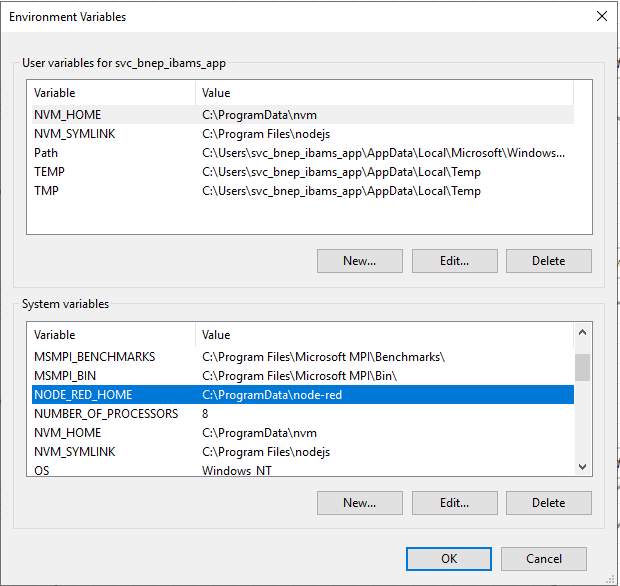


### 5. Install Node-RED dependency nodes

#### node-red-node-sqlite

`node-red-node-sqlite` depends on modules that require Python 3, so install `python3` first. Either download and install following instructions on [official Python website](https://www.python.org/downloads/windows/) or install using your orgainsations Software Centre:

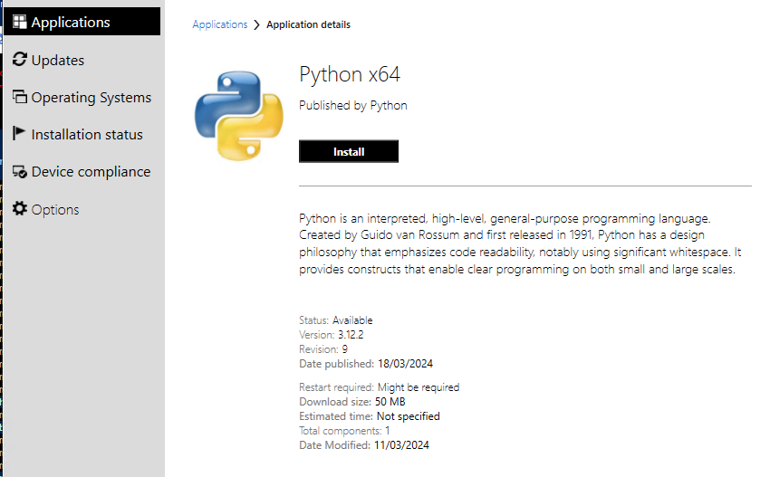

The path to python.exe must be added to the `PATH` system environment variable. Also `PYTHONPATH` must be added as a system environment variable. This may or may not have been completed during installation. If not, add them manually. To permanently modify the default environment variables, click Start and search for 'edit environment variables', or open System properties, Advanced system settings and click the Environment Variables button. ie:

```
PATH: ...C:\Program Files\Python312,
PYTHONPATH: C:\Program Files\Python312
```

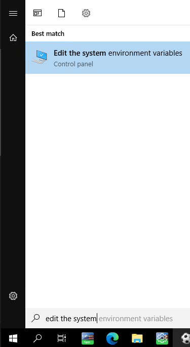
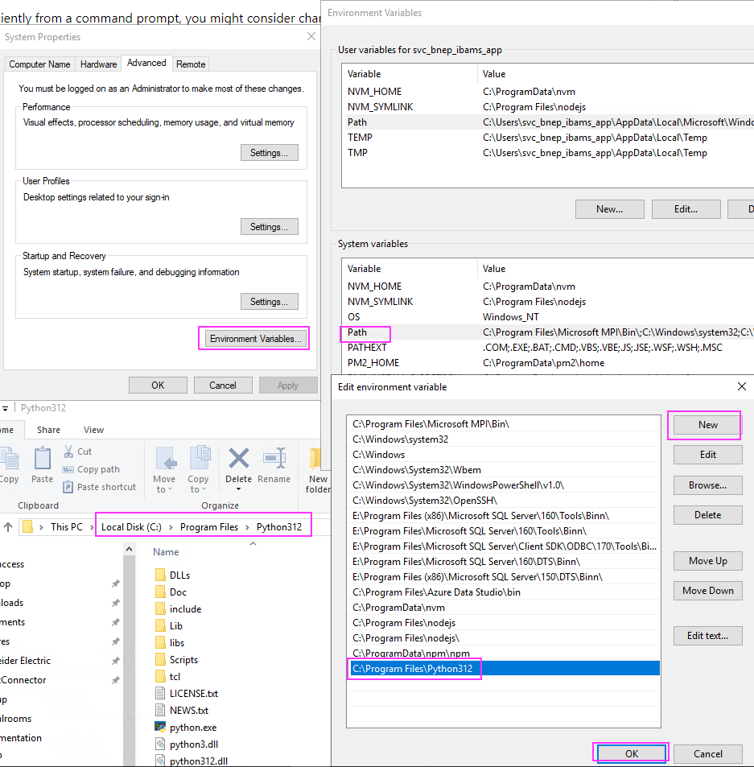
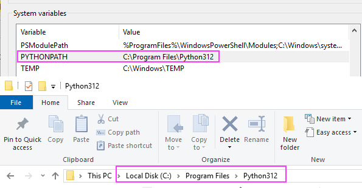

### 6. Install and configure Node-RED SNMP Gateway

1. Download and unzip or clone this repository into `%PROGRAMDATA%/node-red/projects`
2. In powershell or cmd, change directory into `%PROGRAMDATA%/node-red` and start `node-red`:
```
> cd C:\ProgramData\node-red\
C:\ProgramData\node-red> node-red --settings ./settings.js
```
3. Then open Node-RED in web browser at http://127.0.0.1:1880/
4. When prompted, select 'Open existing project', then select 'node-red-snmp-gateway'.

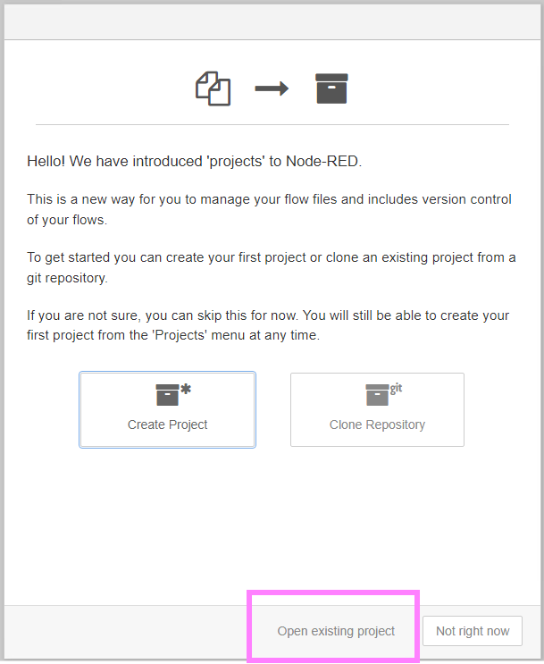
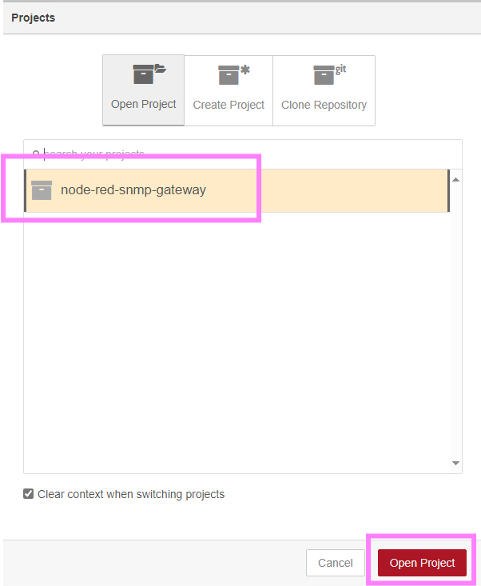

5. Then install the missing dependencies when prompted.

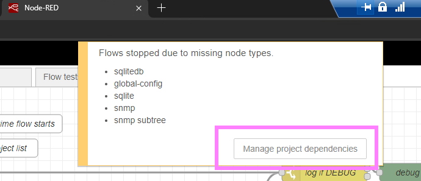

### Logging

If running the `node-red-snmp-gateway` as a Windows service using `pm2`, logging is handled automatically using `pm2-logrotate`, which is automatically installed with `pm2-installer`. Any `node-red` console logs will be written to `%PROGRAMDATA%\pm2\home\logs`.

You will probably want to configure `pm2-logrotate` to suit your needs, open a powershell terminal as Administrator:

```
# install pm2-logrotate if it isnt already
pm2 install pm2-logrotate
# view pm2 and pm2-logrotate config
pm2 conf
# configure pm2-logrotate using
# pm2 set pm2-logrotate:<param> <value>
# rotate logs daily at midnight
pm2 set pm2-logrotate:rotateInterval '0 0 * * *'
# limit max log file size
pm2 set pm2-logrotate:max_size 1M
# set log retention (number of files to keep)
pm2 set pm2-logrotate:retain 500
```

## Testing

To run the tests for the project, trigger the "Flow tests".
